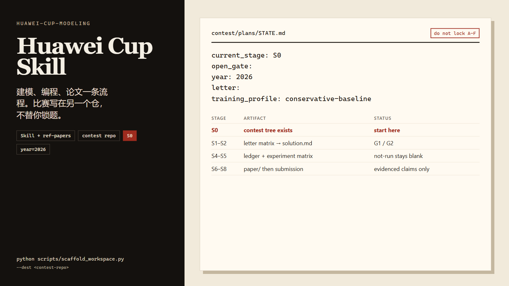

# 华为杯研究生数学建模 Skill

> Cursor Agent Skill + 参考论文库：全题侦察、baseline-first 建模与编程、论文/绘图规范、提交检查。比赛写在**另一个竞赛仓库**，不替你锁题。

<p align="center">
  
</p>

[](https://github.com/TobeMagic/mathmatic_modeling)
[](https://github.com/TobeMagic/mathmatic_modeling)


快速开始：[安装](#快速开始) · [示例](#使用示例) · [竞赛目录](#竞赛仓库结构)

## 目录

- [这是什么](#这是什么)
- [快速开始](#快速开始)
- [功能](#功能)
- [使用示例](#使用示例)
- [Skill 仓库结构](#skill-仓库结构)
- [竞赛仓库结构](#竞赛仓库结构)
- [配置说明](#配置说明)
- [参考论文](#参考论文)
- [常见问题](#常见问题)
- [贡献](#贡献)
- [许可证](#许可证)
- [联系](#联系)

## 这是什么

本仓库给 Cursor Agent 用，不是一篇会自己长出来的参赛论文。

| 仓库 | 放什么 | 不放什么 |
|---|---|---|
| 本 Skill 仓 | `SKILL.md`、规范、`ref-papers/` | 我们的参赛稿 |
| 竞赛仓 | `plans/`、`code/`、`experiments/`、`results/`、`paper/` | 参考国一 PDF 的拷贝 |

一条 Skill 覆盖建模 + 编程规范 + 论文/绘图（含概念图 AI prompt 骨架）。不分论文手 / 建模手入口。缺实验写 `not-run`，不填数。训练分标 `training_score, not official`。

适用：华为杯 / 研赛 / 数模之星 / CPMCM。本科国赛 CUMCM、美赛 MCM、普通作业、SCI 稿不是主路径。

## 快速开始

```bash
git clone https://github.com/TobeMagic/mathmatic_modeling.git
cd mathmatic_modeling
python scripts/year_gate.py
python scripts/scaffold_workspace.py --dest ../huawei-cup-contest
```

然后在 Cursor 打开**本仓库**（根目录 `SKILL.md`），竞赛工作在 `../huawei-cup-contest` 进行。进度先读竞赛仓 `plans/STATE.md`。

需要 runtime zip 时：

```bash
python scripts/pack_skill.py
```

产物在 `dist/`（默认 gitignore），不含 `ref-papers/` PDF。

## 功能

- **S0–S8 流程**：启动 → 全题侦察 → 锁题 → 计划 → baseline → 实验 → 增量论文 → 评阅 → 提交
- **G1–G7 人工门**：Agent 停在 `AWAITING_HUMAN_REVIEW(...)`，不替你选 A–F
- **诚实账本**：`results/result-ledger.csv`；未跑的格子留空
- **论文与图**：`references/paper-style.md`、`references/figure-style.md`、`assets/figure-ai-prompts.md`（概念图可 AI 草图；对比/敏感性图必须用实验数据）
- **提交机械检查**：`python scripts/validate_submission.py`（文件名、匿名、摘要位置；不是质量评委）
- **参考国一**：`ref-papers/pdf/{year}-{tier}-{team_id}-{title}.pdf`，引用时写 `[参考] 文件名 p.N`

## 使用示例

竞赛仓 `plans/STATE.md` 由脚手架写入，开赛时类似：

```yaml
current_stage: S0
open_gate:
year: 2026
letter:
training_profile: conservative-baseline
```

对 Agent 说「华为杯开赛了先全题侦察」时，应收出 A–F 对照矩阵并停在 **G1**，而不是开始写求解器。

未跑的实验在论文里应是：

```text
status=not-run
```

对应数值格留空，不编 RMSE。

## Skill 仓库结构

```text
SKILL.md                 # 主流程
references/              # 按阶段按需加载
assets/                  # 竞赛仓模板与绘图 prompt
scripts/                 # scaffold / year_gate / validate / pack
ref-papers/pdf/          # 参考论文 PDF（REFERENCE_ONLY）
ref-papers/extracts/     # 文本摘录
docs/assets/             # README 封面源与成品
quality/skill-evals/     # 门禁与 dry-run 答卷
```

## 竞赛仓库结构

`scaffold_workspace.py` 生成（无 `compliance/`、`reviews/`、语言代码模板）：

```text
plans/          STATE.md · solution.md · experiment-matrix.md · execution-plan.md
problem/        statement · attachments · official
code/           q1/ q2/   （语言自选）
experiments/    configs/  runs/<run_id>/
results/        result-ledger.csv · figures/ · tables/
paper/          我们的稿；不要拷 ref-papers
```

完整约定见 `references/workspace-layout.md`。

## 配置说明

| 项 | 来源 | 说明 |
|---|---|---|
| `year` | `python scripts/year_gate.py` | 2026-09-18 检出开赛公告与 AI 附件，论文标准文档通知仍未命中 → `year=2026`，未确认格式项标 `year=2025` |
| `training_profile` | 竞赛仓 `plans/STATE.md` | 默认 `conservative-baseline`；`full-draft` 只是训练完整度，不是官方规则 |
| 官方硬规则 | https://cpipc.acge.org.cn/cw/hp/4 | 与 2025 附件冲突时，以当届研创网为准 |
| 训练量表 | `references/scoring-rubric.md` | 不是评委表 |

## 参考论文

命名：

```text
{year}-{tier}-{team_id}-{problem_title}.pdf
```

例：`2024-first-A24102940057-风电场有功功率优化分配.pdf`

这些是**别的队**的稿。禁止把句子写入竞赛 `paper/`，禁止在封面/正文写「本文」指代它们。版权仍归作者与组委会。用法见 `references/ref-paper-usage.md`。

## 常见问题

**会替我选题吗？**  
不会。G1 必须由人说出题号。

**仓库里的 18/18 eval 是现场模型分数吗？**  
不是。`quality/skill-evals/` 里 with-skill 答卷是作者按 `SKILL.md` 写的 dry-run，只用来卡正则门禁。

**没有实验结果能不能先写摘要？**  
可以写结构，不能填未跑的数。标 `not-run`。

**CUMCM 的 20 页 / 8 图 / 15000 字是华为杯规则吗？**  
不是。不要当成本赛硬规则。

## 贡献

改 Skill 或脚手架后跑：

```bash
python scripts/test_scaffold_workspace.py
python scripts/test_year_gate.py
python scripts/test_validate_submission.py
python scripts/test_pack_skill.py
```

可选：`python quality/skill-evals/huawei-cup-modeling/run_evals.py`。不要把 dry-run 写成现场 LLM 有效性。

Issue 与 PR 开在本仓库。竞赛仓请另建 git。

## 许可证

本仓库尚未另选 SPDX 软件许可证。`ref-papers/` 中的获奖论文版权归原作者与竞赛组织方，收入本库仅作 `REFERENCE_ONLY` 训练语料，转载或再发布前请自行确认权利。

## 联系

GitHub: [TobeMagic/mathmatic_modeling](https://github.com/TobeMagic/mathmatic_modeling)
